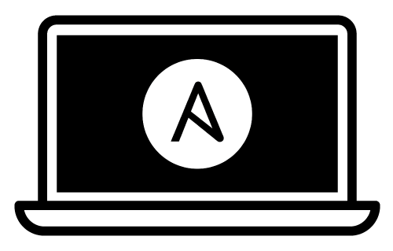

# Mac Development Ansible Playbook

Automate mac dev environment setup with ansible

## Quickstart
```bash
# install dependencies
make install
ansible-galaxy install -r requirements.yml

# run playbook
# * become (sudo)
# * askpass
# * tags: foo,bar
# * limit to group/single host
# * verbose
ansible-playbook main.yml -b -K --tags qa --limit '127.0.0.1' -v
```

## TODO
* [Issues](https://github.com/pythoninthegrass/mac_dev_playbook/issues)

## Further Reading
[OG Author - Jeff Geerling](https://github.com/geerlingguy/mac-dev-playbook)

[Tart](https://github.com/cirruslabs/tart)
